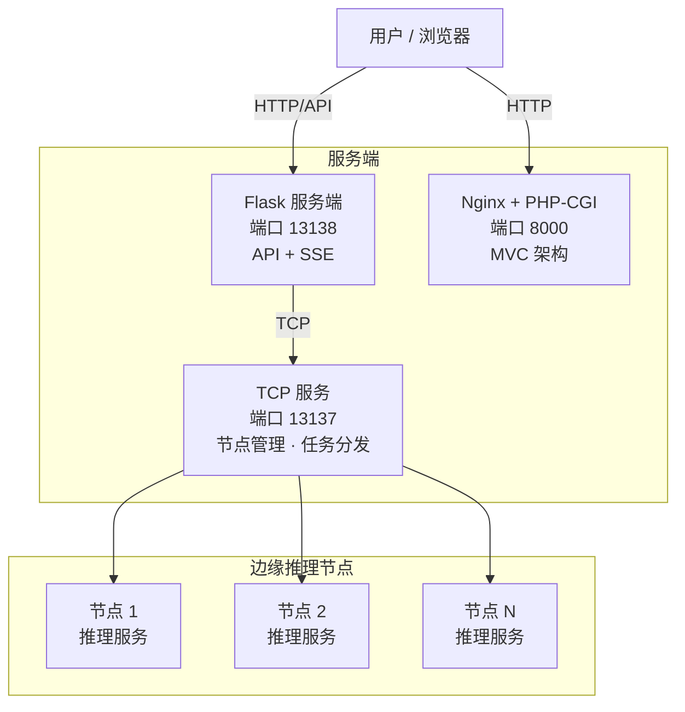

# 37AC 二次元美少女识别系统

<div align="center">

**37AC**（**A**nime **C**haracter recognition）—— 基于深度学习与分布式推理的二次元角色识别平台。


</div>

---

## 目录

- [项目概述](#项目概述)
- [系统架构](#系统架构)
- [功能特性](#功能特性)
- [快速开始](#快速开始)
- [访问方式](#访问方式)
- [文档索引](#文档索引)
- [注意事项](#注意事项)
- [License](#license)
- [联系我们](#联系我们)

---

## 项目概述

37AC 是一个基于分布式 C/S 架构的二次元角色识别系统，支持模型训练、在线图片识别、多节点并行推理、管理仪表盘与权限控制。

- `src/cli/`：训练、预测与边缘节点客户端
- `src/server/`：Flask 服务端、API、节点管理、限流中间件
- `src/www/`：PHP 仪表盘与前端页面

---

## 系统架构



---

## 功能特性

### 模型训练与预测
- YOLOv8 快速定位 + ResNet18 精确分类
- 自动读取类别、校验图片、保存最佳权重与类别映射
- 训练结束后按作品（IP）和角色分别统计识别成功率

### 在线角色识别
- Flask 流式 API + PHP 仪表盘双渠道
- 图片上传、异步推理、SSE 实时结果
- 支持本地模型与第三方多模态大模型（LLM）

### 分布式边缘推理
- 中心服务器通过 TCP 下发任务
- 节点注册、心跳、任务派发、结果回传
- 能力感知调度：37ac / LLM / auto（55% 37ac / 45% LLM）
- 节点启动时自动拉取并同步最新 37ac 模型（下载 + SHA-256 校验）
- 智能重试与 SSE 排队状态推送

### 管理仪表盘
- 自研 AC 设计系统「樱花拿铁」
- 用户注册/登录、API Key、节点管理、模型管理、推理历史、系统设置

### 运行安全与稳定性
- 节点 Token 仅存 SHA-256 哈希
- 节点归属权限隔离
- 统一日志与访问日志
- 端口占用检测：重复启动时会提示是否杀掉旧进程

---

## 快速开始

### 1. 安装依赖

```bash
git clone https://github.com/chijichan/37AC.git
cd 37AC

python -m venv .venv
# Windows: .venv\Scripts\activate
# Linux:   source .venv/bin/activate

pip install -r src/cli/requirements.txt
pip install -r src/server/requirements.txt
```

### 2. 配置

复制并填写各端 `.env`：

```bash
cp src/server/.env.example src/server/.env
cp src/cli/.env.example src/cli/.env
cp src/www/.env.example src/www/.env
```

需要配置数据库连接、JWT 密钥、节点 Token、LLM 开关等，详细说明见 [安装与配置](docs/installation.md)。

### 3. 启动

```bash
# 1. 启动服务端（Flask + TCP）
python src/server/runserver.py

# 2. 启动边缘节点
python src/cli/main.py node

# 3. 启动 PHP 仪表盘（Windows 推荐）
src\www\start-nginx.bat
```

更完整的训练、识别、节点配置见 [使用说明](docs/usage.md)，PHP 部署见 [部署指南](docs/deployment.md)。

---

## 访问方式

| 服务 | 地址 |
|------|------|
| Flask Web / API | `http://localhost:13138` |
| PHP 仪表盘 | `http://localhost:8000` |
| 上传流式接口（直连 Flask） | `POST http://localhost:13138/upload` (Accept: `text/event-stream`) |
| SSE 结果流（直连 Flask） | `GET http://localhost:13138/tasks/<task_id>/stream` |
| 上传代理（推荐浏览器使用） | `POST http://localhost:8000/api/upload` |
| SSE 结果代理 | `GET http://localhost:8000/api/tasks/<task_id>/stream` |

---

## 文档索引

| 文档 | 说明 |
|------|------|
| [项目结构](docs/project-structure.md) | 项目目录、架构、模块分析、更新记录 |
| [安装与配置](docs/installation.md) | 环境安装、依赖、数据库与 .env 配置 |
| [使用说明](docs/usage.md) | CLI 训练/预测、服务端与节点启动、训练细节 |
| [通信协议](docs/protocol.md) | TCP/JSON 协议、消息类型、识别结果结构 |
| [可选功能](docs/features.md) | 测试、LLM 识别、前端上传页功能 |
| [数据集格式](docs/dataset.md) | 数据集目录结构与图片要求 |
| [技术栈](docs/stack.md) | 深度学习、后端、前端技术清单 |
| [部署指南](docs/deployment.md) | Windows / Linux 部署、Nginx、systemd |
| [测试文档](docs/testing.md) | pytest 测试运行与覆盖范围 |
| [前端规范](docs/frontend.md) | PHP 前端架构、设计系统、JS 规范 |

---

## 注意事项

- 请先创建数据库表结构。
- 确保 TCP 服务与节点在线。
- 生产环境请替换默认密钥与密码。
- 推荐使用 GPU 加速训练与推理。
- YOLO 裁剪模式仅保留 `person` 类别，不会保留非 person 图片。
- 服务端重复启动时会检测端口占用，可交互选择杀掉旧进程。

---

## License

本项目基于 [MIT License](LICENSE) 开源。

---

## 联系我们

- 邮箱：qijijiang@126.com
- 项目地址：<https://github.com/chijichan/37AC>
- 团队：37AC 二次元技术研究组

---

<div align="center">

**Enjoy 二次元美少女识别！(≧▽≦)/**

</div>
