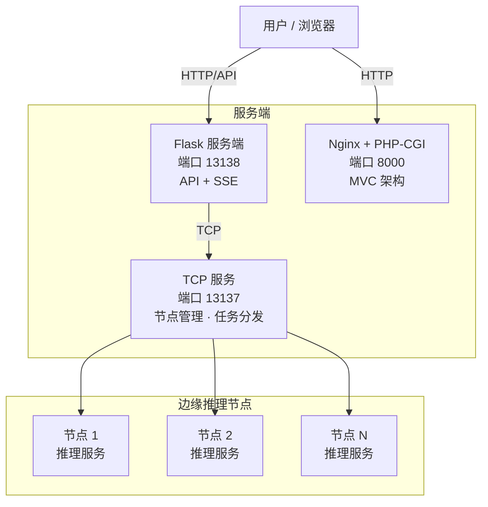

# 37AC 二次元美少女识别系统

<div align="center">

**37AC**（**A**nime **C**haracter recognition）—— 基于深度学习与分布式推理的二次元角色识别平台。


</div>

---

## 目录

- [项目概述](#项目概述)
- [系统架构](#系统架构)
- [功能特性](#功能特性)
- [项目结构](#项目结构)
- [数据集格式要求](#数据集格式要求)
- [技术栈](#技术栈)
- [安装与运行](#安装与运行)
- [使用方法](#使用方法)
- [通信协议规范](#通信协议规范)
- [访问方式](#访问方式)
- [可选功能](#可选功能)
- [注意事项](#注意事项)
- [License](#license)
- [联系我们](#联系我们)

---

## 项目概述

37AC 是一个基于 **分布式 C/S 架构** 的二次元角色识别系统，支持：

- **模型训练**
- **在线图片识别**
- **多节点并行推理**
- **管理仪表盘与权限控制**

系统主要组成：

- `src/cli/`：训练、预测与边缘节点客户端
- `src/server/`：Flask 服务端、API、节点管理、限流中间件
- `src/www/`：PHP 仪表盘与前端页面

---

## 系统架构



---

## 功能特性

### 模型训练与预测
- **YOLO + ResNet** 双阶段架构：YOLOv8 快速定位角色区域，ResNet18 精确分类
- 自动从文件夹读取类别标签
- 支持图片数据校验，排查损坏文件
- 实时展示训练损失与准确率
- 自动保存最佳模型权重与类别映射

### 在线角色识别
- 提供 **Flask 流式API** + **PHP 仪表盘** 双渠道访问
- 支持图片上传、异步推理、结果展示
- 图片格式支持 `.jpg/.jpeg/.png`
- 可视化显示角色置信度与概率分布
- **流式上传**：POST `/upload` 携带 `X-Stream-Response: true` 直接返回 SSE 流，无需二次连接

### 分布式边缘推理
- 中心服务器通过 **TCP** 下发推理任务
- 边缘节点负责模型推理，降低服务器负载
- 包含节点注册、心跳检测、任务派发、结果回传
- 支持并发任务与动态节点调度
- **能力感知分发**：节点注册时声明支持的能力（local/LLM），服务端按识别类型自动匹配
- **智能重试**：任务无节点时自动排队重试，重试间隔按识别方式动态决策（local 快路径 10s / LLM 慢路径 90s，auto 根据在线节点 LLM 能力自动选择）
- **节点归属权限**：普通用户仅管理自己的节点，管理员拥有全部权限
- **Token 哈希存储**：节点 Token 仅存 SHA-256 哈希，防库泄露
- 结果写入 **MySQL** 数据库，支持历史查询

### 管理仪表盘
- 自研 **AC 设计系统**（樱花粉单强调色，Nunito + JetBrains Mono 自托管字体，Phosphor 图标）
- 支持用户注册、登录、密码找回
- API Key 管理与节点状态监控
- **节点管理**：创建（可自定义/自动生成 Token）、修改（含 Token 更新）、详情、删除（仅所属用户或管理员）
- 推理历史查看（服务端真实分页与筛选）与系统设置
- 上传请求经 PHP 同源代理，站级 API Key 不下发前端

### 运行安全与稳定性
- 前端限制上传类型与大小
- 后端严格区分 JSON 控制消息与图片数据
- **任务自动重试**：无节点排队等待，节点上线自动分发；SSE 等待超时按识别方式动态调整（最长约 7 分钟），超时友好提示不误报失败
- **统一日志**：根 logger + RotatingFileHandler（10MB×5 轮转），CLI/Server 共享同一配置
- 推荐生产环境替换默认密钥与密码

---

## 项目结构

```text
37AC/
├─ src/
│  ├─ common/                          # ✨ CLI/Server 共享公共模块
│  │  ├─ protocol.py                  # JSON 消息协议（双端实例）
│  │  ├─ constants.py                 # 图片扩展名/协议/节点常量
│  │  ├─ crypto.py                    # 节点 token 哈希与验证
│  │  ├─ db_utils.py                  # 通用 SQL 构建
│  │  └─ log_config.py                # 统一日志（根 logger + RotatingFileHandler）
│  ├─ cli/
│  │  ├─ main.py
│  │  ├─ .env.example
│  │  ├─ config/
│  │  │  ├─ base.py
│  │  │  └─ log_config.py             # 薄封装 → src/common/log_config.py
│  │  ├─ data/dataset.py
│  │  ├─ models/character_model.py
│  │  ├─ training/trainer.py
│  │  ├─ prediction/predictor.py          # 含 LLM API + _parse_llm_response
│  │  ├─ services/
│  │  │  ├─ node_service.py               # TCP 客户端 + 异步 LLM
│  │  │  └─ menu_service.py
│  │  ├─ utils/
│  │  │  ├─ file_utils.py
│  │  │  ├─ image_utils.py
│  │  │  └─ validation_utils.py
│  │  ├─ requirements.txt
│  │  └─ saves/
│  │     ├─ logs/
│  │     └─ models/
│  │        ├─ 37ac-v0.0.1.pth           # 模型权重
│  │        ├─ classes.txt                # 类别映射（每行 IP/角色，兼容）
│  │        └─ classes.json               # 类别结构化（{IP/角色: {id,ip,name_zh}}，优先）
│  └─ server/
│     ├─ runserver.py
│     ├─ .env.example
│     ├─ requirements.txt
│     ├─ config/
│     │  ├─ base.py
│     │  ├─ email_config.py
│     │  └─ log_config.py             # 薄封装 → src/common/log_config.py
│     ├─ middleware/
│     │  ├─ auth_middleware.py
│     │  └─ rate_limiter.py
│     ├─ routes/                          # 7 个蓝图
│     ├─ services/
│     │  ├─ listen_service.py             # TCP 监听
│     │  ├─ node_manager.py               # 节点管理（含 LLM 能力感知）
│     │  ├─ task_manager.py               # 任务重试（LLM感知 + auto 智能间隔）
│     │  ├─ task_dispatcher.py            # 任务分发
│     │  ├─ message_handlers.py           # 消息处理 + SSE 推送
│     │  ├─ sse_bus.py                    # SSE 事件总线
│     │  ├─ async_processor.py            # 异步线程池
│     │  ├─ protocol/json_protocol.py     # JSON 协议（兼容层 → src/common/protocol.py）
│     │  ├─ auth/                         # 认证工具
│     │  └─ dashboard/                    # 仪表盘服务
│     ├─ AC_web/__init__.py               # Flask 应用初始化
│     └─ saves/
├─ src/www/
│  ├─ public/
│  │  ├─ index.php                       # 入口（路由注册、.env、JWT 验证）
│  │  └─ static/
│  │     ├─ css/ac-tokens.css            # AC 设计系统变量
│  │     ├─ css/ac-components.css        # 组件库
│  │     ├─ css/vendor/                  # 本地化第三方 CSS（cropper、phosphor）
│  │     ├─ scripts/app.js               # 全局模块（Notify/Modal/escapeHtml）
│  │     ├─ scripts/auth.js              # JWT 认证
│  │     ├─ scripts/vendor/              # 本地化第三方 JS（cropper、imgly、onnxruntime）
│  │     └─ fonts/                       # 自托管可变字体（Nunito、JetBrains Mono）
│  ├─ router.php
│  ├─ .env.example
│  ├─ start-nginx.bat / stop-nginx.bat  # Nginx + PHP-CGI 启动/停止（推荐）
│  ├─ start-server.bat                   # php -S 单线程内置服务器（仅快速调试）
│  ├─ controllers/
│  │  └─ api_controller.php              # API 代理（X-API-Key 服务端注入）
│  ├─ views/
│  │  ├─ layout.php / footer.php / error.php
│  │  ├─ home/upload.php                 # 上传识别（裁剪/去背景/链接上传 + SSE）
│  │  ├─ home/about.php
│  │  ├─ home/contact.php
│  │  ├─ dashboard/                      # SPA 壳 + 5 个子页
│  │  └─ auth/
│  ├─ DASHBOARD.md
│  └─ SECURITY.md
├─ docs/项目结构总结.md
├─ docs/前端规范.md
├─ docs/测试文档.md
├─ scripts/alter_tables.sql
├─ verify_env.py
└─ tests/
   ├─ pytest.ini
   ├─ conftest.py
   ├─ requirements-test.txt
   ├─ cli/
   │  ├─ test_config.py
   │  ├─ test_file_utils.py
   │  ├─ test_image_utils.py
   │  ├─ test_validation_utils.py
   │  ├─ test_character_model.py
   │  ├─ test_dataset.py
   │  ├─ test_trainer.py
   │  ├─ test_predictor.py
   │  └─ test_log_config.py
   └─ server/
      ├─ test_validators.py
      ├─ test_jwt_utils.py
      ├─ test_password_service.py
      ├─ test_auth_service.py
      ├─ test_user_service.py
      ├─ test_api_key_service.py
      ├─ test_rate_limiter.py
      ├─ test_sse_bus.py
      └─ test_auth_middleware.py
```

> `src/cli/`：训练、预测与节点客户端。  
> `src/server/`：Flask 服务端与节点管理。  
> `www/`：PHP 仪表盘与前端页面。

---

## 数据集格式要求

训练数据目录应按角色分类组织：

```text
dataset/
├─ 作品A/
│  ├─ 角色A/
│  │  ├─ 001.jpg
│  │  └─ 002.png
│  └─ 角色B/
└─ 作品B/
   └─ 角色C/
```

- 支持 `.jpg`、`.jpeg`、`.png`
- 图片应清晰、无遮挡、正面
- 建议每个角色至少 100 张图片

---

## 技术栈

### 深度学习与后端

| 技术 | 用途 |
|------|------|
| Python 3.12 | 开发语言（原生 `str \| None` 联合类型） |
| PyTorch 2.13 | 模型训练与推理 |
| YOLOv8 (Ultralytics 8.4) | 人物快速定位（person 类别检测+裁剪，可选） |
| ResNet18 | 角色分类网络（37AC v0.0.1） |
| torch-directml | AMD GPU 加速 |
| Flask 3.1 | Web/API 框架 |
| Pillow 12.3 | 图像处理 |
| torchvision 0.28 | 数据加载与增强 |
| opencv-python 5.0 | YOLO 依赖与图像处理 |
| tqdm | 训练进度显示 |
| requests | LLM API 调用 |

### 数据库与通信

| 技术 | 用途 |
|------|------|
| MySQL 5.7 | 数据存储 |
| TCP Socket | 中心与节点通信 |
| 自定义协议 | 长度前缀 + JSON/二进制 |

### Web 前端

| 技术 | 用途 |
|------|------|
| PHP 7+ | 仪表盘后端 |
| AC 设计系统（自研） | 设计变量 + 组件库（替代原 Pico CSS） |
| Nunito / JetBrains Mono | 自托管可变字体 |
| Phosphor Icons | 图标（自托管 web font） |
| Cropper.js 1.6.2 | 图片裁剪（自托管） |
| @imgly/background-removal 1.7.0 | AI 去背景（ESM 自托管，WASM 模型自托管） |
| Auth.js | JWT 认证模块 |
| EventSource (SSE) | 实时结果推送 |

> 前端页面零外部 CDN 引用，第三方依赖全部本地化于 `src/www/public/static/vendor/`。

### 安全与认证

| 技术 | 用途 |
|------|------|
| JWT | API 身份验证 |
| bcrypt | 密码哈希 |
| CORS | 跨域支持 |

---

## 安装与运行

### 1. 克隆仓库

```bash
git clone https://github.com/chijichan/37AC.git
cd 37AC
```

### 2. 创建并激活虚拟环境（推荐 Python 3.12）

```bash
python -m venv .venv
.venv\Scripts\activate
```

### 3. 安装依赖

```bash
pip install -r src/cli/requirements.txt
pip install -r src/server/requirements.txt
```

> **AMD GPU (RX 580) 用户**：额外安装 DirectML 加速：
> ```bash
> pip install torch-directml
> # 然后在 .env 中设置 USE_DIRECTML=True
> ```

### 4. 配置数据库

```bash
mysql -u root -p < scripts/alter_tables.sql
```

编辑 `src/server/config/base.py`，配置数据库连接、JWT 密钥等。

也可通过 `src/server/.env` 文件配置（推荐）：

```env
# 服务端配置
DB_HOST=your_db_host
DB_USER=your_db_user
DB_PASSWORD=your_db_password
DB_NAME=your_db_name
JWT_SECRET=your-jwt-secret-key-change-this-in-production

# 节点配置（src/cli/.env）
NODE_ID=1
TOKEN=your_node_token
LLM_RECOGNITION_ENABLED=false
LLM_API_KEY=your_api_key

# PHP Web 配置（src/www/.env）
API_BASE_URL=http://127.0.0.1:13138
UPLOAD_API_KEY=your_upload_api_key   # 与后端 UPLOAD_API_KEYS 一致，仅存服务端
APP_DEBUG=false                      # 生产必须为 false
```

### 5. 启动 Flask 服务端

```bash
python src/server/runserver.py
```

## 使用方法

### 1. 训练模型

#### 命令行模式

```bash
# 从头训练（ImageNet 预训练）
python src/cli/main.py --mode 1

# 继续训练（自动使用当前模型权重）
python src/cli/main.py --mode 1 --resume

# 继续训练（指定历史权重文件）
python src/cli/main.py --mode 1 --resume saves/models/37ac_p_2026071315.tar
```

命令行模式下 `--resume` 参数直接决定训练方式，不会弹出交互子菜单。

#### 交互菜单模式

```bash
python src/cli/main.py
```

选择 **1. 训练模型** 后，首先选择训练方式：

```
  选择训练方式
  [1] 从头训练（ImageNet 预训练）
  [2] 继续训练（基于已有权重: 37ac-v0.0.1.pth）
  [0] 返回主菜单
----------------------------------------
请选择 (1/2/0):
```

- **[1] 从头训练** — 从 ImageNet 预训练权重开始，分两阶段微调
- **[2] 继续训练** — 基于已有模型权重继续训练，跳过阶段1，直接全局精调

然后选择数据集：

```
  选择训练数据集
  [1] 原始数据集: W:\Img
  [2] 已裁剪数据集: .../saves/dataset（使用已存在的 YOLO 裁剪结果）
  [3] 使用 YOLO 裁剪原始数据集后训练（从头裁剪，保存到 saves/dataset/）
  [0] 返回主菜单
----------------------------------------
请选择 (1/2/3/0):
```

#### 类别数变化支持

继续训练时自动检测类别数变化：

| 场景 | 处理方式 |
|------|---------|
| 类别数 **不变**（如 88→88） | 全量加载所有权重，包括 fc 分类头 |
| 类别数 **变化**（如 88→100） | 跳过 fc 层，只加载 backbone + CBAM，fc 层随机初始化新分类头 |

新增角色到数据集后直接继续训练即可，无需从头开始。

#### 训练参数

可在 `src/cli/.env` 中配置：
- `MAX_IMAGES_PER_ROLE` — 单个角色最大保留张数（YOLO 裁剪时生效），默认 `100`
- 图片按文件大小降序处理，优先保留高质量大图

#### 自动备份机制

每次训练开始前，系统会自动将当前模型权重和 `classes.txt` 备份到 `saves/models/_bak/` 目录，防止覆盖后无法回退：

```text
saves/models/_bak/
├─ 37ac-v0.0.1_bak_20260716_183000.pth
├─ classes_bak_20260716_183000.txt
├─ 37ac-v0.0.1_bak_20260717_091500.pth
└─ classes_bak_20260717_091500.txt
```

备份文件名包含时间戳，支持多次训练的历史回溯。

#### 训练结果

- `src/cli/saves/models/37ac-v0.0.1.pth`
- `src/cli/saves/models/classes.txt`

### 2. 启动 Flask 服务端

```bash
python src/server/runserver.py
```

默认地址：
- Flask Web：`http://127.0.0.1:13138`
- TCP 节点服务：`0.0.0.0:13137`

### 3. 启动 PHP 仪表盘

前端使用 **Nginx + PHP-CGI 进程池**（Windows 下 PHP-FPM 的等价方案），
支持 SSE 长连接并发，不会阻塞其他请求。详细部署见 [`docs/部署指南.md`](docs/部署指南.md)。

```bash
# 一键启动（4 个 php-cgi 实例 + Nginx）
src\www\start-nginx.bat

# 停止
src\www\stop-nginx.bat
```

> 旧方案 `php -S` 为单线程，SSE 流式代理期间会阻塞其他请求，仅保留用于快速调试：
> `php -S 127.0.0.1:8000 -t public/` 或 `src\www\start-server.bat`

访问：`http://127.0.0.1:8000`

### 4. 启动边缘节点

```bash
python src/cli/main.py --mode 4
```

> 推荐启动顺序：Flask 服务端 -> PHP 仪表盘 -> 边缘节点

---

## 通信协议规范

### 协议概览

- 协议：`TCP`
- 连接方式：节点主动长连接
- 文本：`JSON` UTF-8
- 图片：Base64 或原始二进制
- 边界：长度前缀模式

### 核心消息类型

| 类型 | 方向 | 说明 |
|------|------|------|
| register | 节点 -> 服务器 | 节点注册（含 capabilities / max_tasks 等元数据） |
| register_ack | 服务器 -> 节点 | 注册确认 |
| heartbeat | 节点 -> 服务器 | 心跳 |
| heartbeat_ack | 服务器 -> 节点 | 心跳确认 |
| task | 服务器 -> 节点 | 推理任务（含 recognition_type） |
| task_result | 节点 -> 服务器 | 结果回传 |

### 注册消息示例

```json
{
  "type": "register",
  "timestamp": 1700000000,
  "data": {
    "node_id": 1,
    "token": "your-node-token",
    "max_tasks": 5,
    "capabilities": "[\"local\",\"llm\"]",
    "llm_enabled": false,
    "llm_timeout_sec": 30
  }
}
```

- `capabilities`：JSON 数组字符串，声明节点支持的推理能力
  - `["local"]` — 仅支持本地 ResNet 模型（默认）
  - `["local","llm"]` — 同时支持本地模型和第三方多模态大模型
- `llm_enabled` / `llm_timeout_sec`：节点 LLM 能力与推理超时，服务端据此决策任务重试间隔
- 节点 Token 在数据库中仅存 **SHA-256 哈希**（新建节点时由服务端生成或用户自定义）
- 服务端 `NodeManager` 根据 `recognition_type` 匹配具备相应能力的空闲节点，实现智能分发

### 任务下发消息示例

```json
{
  "type": "task",
  "timestamp": 1700000000,
  "data": {
    "task_id": "uuid",
    "image_filename": "test.jpg",
    "image_data": "base64_encoded...",
    "recognition_type": "local"
  }
}
```

- `recognition_type`：由服务端根据节点能力自动选择后下发
  - `local` — 使用本地 ResNet 模型
  - `llm` — 使用第三方多模态大模型 API
  - `auto` — 由节点根据自身配置决定

### 任务重试机制

任务分发时若无空闲节点，将进入等待队列自动重试：

| 识别方式 | 重试间隔 | 说明 |
|---------|---------|------|
| `local` | 10s | 本地推理快，短间隔快速重试 |
| `llm` | 90s（或节点上报 LLM 超时 +15s） | 大模型推理耗时数秒~数十秒，避免重复分发 |
| `auto` | 10s / 90s | **智能决策**：无在线 LLM 节点时走 10s 快路径，否则 90s 保守 |

- 最大重试次数：`TASK_MAX_RETRIES`（默认 3）
- 等待队列任务在节点上线后自动分发，前端 SSE 实时推送排队状态与预计重试时间

### 错误码

任务结果中的 `result` 字段在出错时包含 `error` 描述。

---

## 访问方式

| 服务 | 地址 |
|------|------|
| Flask Web / API | `http://localhost:13138` |
| PHP 仪表盘 | `http://localhost:8000` |
| 上传流式接口（直连 Flask） | `POST http://localhost:13138/upload` (Accept: `text/event-stream`) |
| SSE 结果流（直连 Flask） | `GET http://localhost:13138/tasks/<task_id>/stream` |
| 上传代理（经 PHP，推荐浏览器使用） | `POST http://localhost:8000/api/upload` |
| SSE 结果代理（经 PHP） | `GET http://localhost:8000/api/tasks/<task_id>/stream` |

---

## 可选功能

- CLI 图片校验：`python src/cli/main.py --mode 3`
- 单张命令行预测：`python src/cli/main.py --mode 2`
- 环境检查：`python verify_env.py`

### 运行测试

确保已安装测试依赖：

```bash
pip install -r tests/requirements-test.txt
```

> ⚠️ **注意**：CLI 与 Server 各自拥有独立的 `config` 包，不能在同一个 Python 进程中共存。
> 必须**分目录运行**测试：

```bash
# CLI 模块测试（89 个）
pytest tests/cli/

# 服务端模块测试（94 个）
pytest tests/server/
```

指定测试文件：

```bash
pytest tests/cli/test_file_utils.py

# 带覆盖率报告
pytest --cov=src --cov-report=html
```

测试覆盖范围：

| 模块 | 覆盖内容 |
|------|---------|
| CLI 配置 | 环境变量读取、默认值、特性开关、节点配置、能力列表 |
| 文件工具 | 哈希计算、目录创建、类别文件读写、模型文件检查 |
| 图片工具 | 有效/损坏/非图片文件验证、尺寸检查、色彩模式转换 |
| 数据集验证 | IP/角色两级目录结构、隐藏目录跳过、无效图片检测 |
| 角色模型 | 模型构建、前向传播、冻结/解冻、保存/加载、类别数变化兼容 |
| 数据集加载 | IPRoleImageFolder 的类别映射、样本索引、隐藏目录过滤 |
| 训练器 | 标签平滑损失、数据集拆分、模型备份、函数签名 |
| 预测器 | 参数校验、图片预处理、结果展示、模型缓存逻辑 |
| 日志系统 | 日志级别、处理器配置、传播控制 |
| 验证器 | 邮箱/用户名/密码格式验证 |
| JWT 工具 | 令牌生成、解码、过期检测、篡改检测 |
| 密码服务 | 哈希、验证、密码修改、弱密码拒绝 |
| 认证服务 | 注册/登录/令牌刷新、重复用户/禁用账号/令牌类型检查 |
| 用户服务 | 用户查询、资料更新、列表分页 |
| API 密钥 | 创建/查询/哈希、权限校验、密钥格式 |
| 限流中间件 | 滑动窗口结构、禁用开关、装饰器封装 |
| SSE 事件总线 | 订阅/发布/取消、多订阅者、超时处理、JSON 序列化 |
| 认证中间件 | 令牌提取、登录/管理员装饰器、refresh token 拒绝 |

### 第三方大模型（LLM）识别

在 `.env` 中启用 LLM 识别后可获得更精确的识别结果：

```env
LLM_RECOGNITION_ENABLED=true
LLM_API_KEY=your_api_key
LLM_API_URL=https://api.deepseek.com/v1/chat/completions
LLM_MODEL_NAME=deepseek-v4.1-pro
LLM_TIMEOUT_SEC=30
```

LLM 推理在单独的后台线程中执行，不会阻塞节点的主消息循环。

### 前端上传页功能

上传页（`/upload`）支持：

- **本地上传**：点击选择或拖拽（JPG/PNG，最大 10MB），选择后立即显示预览
- **链接上传**：粘贴图片 URL 直接加载（走相同的处理流程）
- **图片处理**（可选）：手动框选裁剪（Cropper.js，粉色主题适配）/ 自动裁剪（YOLO）；AI 去背景（imgly + onnxruntime，WASM 模型自托管）
- **流式识别**：经 PHP 代理 `/api/upload` SSE 透传，实时显示上传/排队/识别进度
  - 排队时显示预计重试倒计时（"约 X 秒后自动重试，节点上线即分发"）
  - SSE 等待超时按识别方式动态计算（local 约 3 分钟 / LLM 约 7 分钟），超时友好提示而非误报失败
  - 结果含置信度条与识别来源徽章（本地模型 / 大模型）

---

## 注意事项

- 请先创建数据库表结构
- 确保 TCP 服务与节点在线
- 生产环境请替换 `base.py` 默认密钥
- 推荐使用 GPU 加速训练与推理
- AMD 用户（RX 580 等）可使用 PyTorch-DirectML 加速：`pip install torch-directml` + `.env` 中设置 `USE_DIRECTML=True`
- YOLO 裁剪模式仅保留 `person` 类别的检测结果，不会保留非 person 图片
- `MAX_IMAGES_PER_ROLE` 控制单个角色最大样本数，超出部分不会被裁剪保存

---

## License

本项目仅限内部研究使用，禁止商用及二次分发。如需商用或二次分发，请联系作者。

---

## 联系我们

- 邮箱：qijijiang@126.com
- 项目地址：<https://github.com/chijichan/37AC>
- 团队：37AC 二次元技术研究组

---

<div align="center">

**Enjoy 二次元美少女识别！(≧▽≦)/**

</div>
