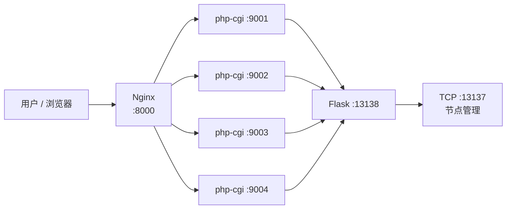

# 37AC 前端部署指南（Windows / Linux）

> 本文档提供两种部署方式：
> - **Windows**（第 〇~七 节）：Nginx + 多实例 `php-cgi.exe` 进程池（本机开发 / 内网）；
> - **Linux**（第 八 节）：Nginx + 原生 PHP-FPM + systemd（生产推荐）。
>
> Windows 无 PHP-FPM（仅 Linux/Unix 提供），故使用 **多个 `php-cgi.exe` 实例组成进程池** 实现同等效果。
> 相比 `php -S` 内置服务器（单线程），Nginx + PHP-CGI 进程池可**并发处理请求**，
> SSE 流式长连接只会占用一个 php-cgi 实例，其余请求由其他实例并行处理。

## 架构



## 环境要求

| 组件 | 要求 | 说明 |
|---|---|---|
| Nginx | 1.26+ | 安装于 `C:\tools\nginx` |
| PHP | 8.x（含 `php-cgi.exe`） | 本机 `E:\apps\PHP` |
| MySQL | 5.7+ / 8.x | 数据库 `37ac`，utf8mb4；连接信息见 `src/server/.env` |
| Flask 服务端 | 运行中 | `python src/server/runserver.py`，监听 `13138`/`13137` |

## 〇、数据库安装

### 1. 全新安装（推荐）

仓库提供两种安装方式，均**不含真实业务数据**（避免把真实密码哈希、节点 Token、IP、API 密钥等敏感信息带入安装）。

**方式 A（推荐）— 交互式脚本（可设置管理员）**

```bash
python scripts/install_db.py
```

脚本会：读取 `src/server/.env` 数据库连接信息 → 执行 `install.sql` 建库建表 → 交互式输入
管理员用户名 / 密码 / 邮箱，以 **bcrypt 哈希**写入管理员账号（密码不回显、不落明文）。

**方式 B — 纯 SQL 脚本**

```bash
mysql -u<用户名> -p < scripts/install.sql
```

脚本会创建：

| 表 | 说明 |
|---|---|
| `users` | 用户表（含 `token_version` 字段，用于单端登录） |
| `nodes` | 推理节点表 |
| `api_keys` | API 密钥表 |
| `task_results` | 识别任务结果表 |
| `password_reset_tokens` | 密码重置令牌表 |

> 脚本默认插入一个管理员账号 `admin`（密码为**随机生成**的占位 bcrypt 哈希，无法直接登录）。
> 安装完成后请通过以下任一方式为其设置真实密码：
> - **方式一（推荐）**：启动服务后用 `admin` 触发「忘记密码」，将重置邮件发送到
>   脚本预设的邮箱（`admin@example.com`，部署后请先改为真实邮箱）后按链接设置新密码；
> - **方式二**：直接用 SQL 更新为新的 bcrypt 哈希：
>   ```sql
>   UPDATE `37ac`.`users`
>      SET password_hash='<新bcrypt哈希>', email='你的邮箱'
>    WHERE username='admin';
>   ```

### 2. 已有数据库升级

若数据库已存在但缺少新字段（如 `users.token_version`），执行增量变更脚本：

```powershell
mysql -u<用户名> -p < e:\pj\37AC\scripts\alter_tables.sql
```

当前 `alter_tables.sql` 包含：`nodes.user_id`、`nodes.capabilities`、`api_keys` 表、
`task_results.user_id/api_key_id`、`password_reset_tokens` 表、`users.token_version`（单端登录）。

> 注意：`install.sql` 与 `alter_tables.sql` 均不包含真实敏感数据，请勿将 phpMyAdmin 导出的
> 含真实密码哈希/Token/IP 的完整 dump 提交到仓库。

## 一、安装 Nginx（一次性）

```powershell
# 下载稳定版
Invoke-WebRequest -Uri "https://nginx.org/download/nginx-1.26.3.zip" -OutFile "C:\tools\nginx-1.26.3.zip"
# 解压并重命名
Expand-Archive -Path "C:\tools\nginx-1.26.3.zip" -DestinationPath "C:\tools\" -Force
Rename-Item "C:\tools\nginx-1.26.3" "C:\tools\nginx"
# 校验
& "C:\tools\nginx\nginx.exe" -v
```

## 二、PHP 专用配置 `php-cgi.ini`（一次性）

FastCGI 模式下 **Xdebug 会拖慢每个请求**（函数级 hook），而 opcache 能显著提速。
为 `php-cgi` 生成专用配置（不影响 CLI 调试用的 `php.ini`）：

```powershell
$src = Get-Content "E:\apps\PHP\php.ini"
$lines = New-Object System.Collections.Generic.List[string]
foreach ($l in $src) {
    $trimmed = $l.Trim()
    # 剔除 Xdebug 相关行
    if ($trimmed -match '^zend_extension=.*xdebug' -or $trimmed -eq '[xdebug]' -or $trimmed -match '^xdebug\.') { continue }
    # 启用 opcache
    if ($trimmed -eq ';zend_extension=opcache') { $lines.Add('zend_extension=opcache'); continue }
    if ($trimmed -eq ';opcache.enable=1') { $lines.Add('opcache.enable=1'); continue }
    $lines.Add($l)
}
[System.IO.File]::WriteAllLines("E:\apps\PHP\php-cgi.ini", $lines, (New-Object System.Text.UTF8Encoding $false))
# 验证：应显示 opcache.enable = On，且无 xdebug
& "E:\apps\PHP\php-cgi.exe" -c "E:\apps\PHP\php-cgi.ini" -i | Select-String "opcache.enable|xdebug"
```

> 实测：未优化前 `/upload` 响应 6~14 秒；禁用 Xdebug + 启用 opcache 后降至 **0.2 秒**。

## 三、Nginx 配置 `C:\tools\nginx\conf\nginx.conf`

关键点：

- `root E:/pj/37AC/src/www/public;` — 站点根目录
- `try_files $uri $uri/ /index.php?$query_string;` — 对应原 `.htaccess` 重写规则
- `upstream php_backend { server 127.0.0.1:9001..9004; }` — PHP-CGI 进程池
- `fastcgi_buffering off;` — SSE 流式响应实时透传，不做缓冲
- `fastcgi_read_timeout 480s;` — 适配最长 SSE 长连接（识别方式不同等待上限不同：local 约 3 分钟，LLM/auto 约 7 分钟，均含排队重试时间）
- `client_max_body_size 12m;` — 图片上传上限

完整配置见仓库 `docs/` 附件说明，或参照 `src/www/start-nginx.bat` 启动流程。

## 四、启动 / 停止

```bat
:: 启动（Nginx + 4 个 php-cgi 实例）
src\www\start-nginx.bat

:: 停止
src\www\stop-nginx.bat
```

启动脚本要点：

1. 检查 8000 端口空闲
2. 启动 4 个 `php-cgi.exe`（监听 9001~9004，使用 `php-cgi.ini`）
3. 启动 Nginx（`-p C:\tools\nginx\` 指定前缀目录）

## 五、验证

```powershell
# 页面
curl.exe -s -o NUL -w "%{http_code} (%{time_total}s)`n" http://localhost:8000/upload
# 期望: 200 (<1s)

# SSE 全链路（Nginx → PHP → Flask → 节点）
curl.exe -s -N --max-time 480 `
  -H "X-Stream-Response: true" -H "X-Requested-With: XMLHttpRequest" `
  -F "file=@test.png" -F "recognition_type=local" `
  http://localhost:8000/api/upload
# 期望: 依次收到 queued → ... → completed 事件

# 无节点排队场景（观察重试与等待提示）
# 期望: queued(含 timeout 提示) → waiting(含 retry_in 倒计时) → 节点上线后自动分发
```

## 六、故障排查

| 现象 | 原因 | 解决 |
|---|---|---|
| 页面响应 6~14 秒 | Xdebug 在 FastCGI 下每请求开销 | 确认 `php-cgi.ini` 无 Xdebug |
| SSE 不实时，攒批返回 | Nginx 缓冲了响应 | 确认 `fastcgi_buffering off` |
| `nginx: [emerg] unknown directive "锘?` | 配置文件带 UTF-8 BOM | 用无 BOM 编码重写 conf |
| 端口被占用 | 旧服务未停止 | `stop-nginx.bat` 或 `taskkill /IM nginx.exe /F` |
| 上传 413 | 图片超过限制 | 调大 `client_max_body_size` |

## 七、生产环境建议

- 本项目 Nginx 配置为**开发/内网**用途（无 TLS、单机部署）
- 生产建议：启用 HTTPS（`ssl_certificate`）、隐藏 server 版本、按需调整 `worker_processes`
- 若部署到 Linux，推荐直接使用原生 **PHP-FPM**（详见「八、Linux 部署方式」）

## 八、Linux 部署方式（Nginx + PHP-FPM + systemd）

> Linux 有原生 PHP-FPM，无需 Windows 的 php-cgi 进程池方案。
> 本节以 **Ubuntu / Debian** 为例，其他发行版命令略有差异。

### 8.1 架构


### 8.2 环境要求

| 组件 | 版本 | 安装方式 |
|---|---|---|
| Nginx | 1.26+ | `apt install nginx` |
| PHP-FPM | 8.x（含 `php-mysql`） | `apt install php-fpm php-mysql` |
| MySQL | 5.7+ / 8.x | `apt install mysql-server` |
| Python | 3.10+ | `apt install python3 python3-venv python3-pip` |

### 8.3 安装依赖并部署代码

```bash
sudo apt update
sudo apt install -y nginx php-fpm php-mysql mysql-server python3 python3-venv python3-pip git

# 部署代码（或直接复制项目到 /opt/37AC）
sudo git clone <仓库地址> /opt/37AC
cd /opt/37AC

# 创建 Python 虚拟环境并安装服务端依赖
python3 -m venv .venv
source .venv/bin/activate
pip install -r src/server/requirements.txt
```

### 8.4 配置环境变量

```bash
cd /opt/37AC
cp src/server/.env.example src/server/.env
vi src/server/.env   # 填写 DB_HOST / DB_USER / DB_PASSWORD / DB_NAME 等
```

### 8.5 安装数据库

**方式 A（推荐）— 交互式脚本（可设置管理员）**

```bash
cd /opt/37AC
source .venv/bin/activate
python scripts/install_db.py
# 按提示输入管理员用户名 / 密码 / 邮箱，脚本将执行 install.sql 建库建表，
# 并以 bcrypt 哈希写入管理员账号。
```

**方式 B — 纯 SQL 脚本（管理员密码为随机占位，需另行设置）**

```bash
cd /opt/37AC
mysql -u<用户名> -p < scripts/install.sql
```

> 已有数据库升级时执行 `scripts/alter_tables.sql`。

### 8.6 配置 Nginx

新建站点配置 `/etc/nginx/sites-available/37ac`：

```nginx
server {
    listen 80;
    server_name your.domain.com;

    root /opt/37AC/src/www/public;
    index index.php index.html;

    # 对应原 .htaccess 重写规则
    location / {
        try_files $uri $uri/ /index.php?$query_string;
    }

    location ~ \.php$ {
        include snippets/fastcgi-php.conf;
        fastcgi_pass unix:/run/php/php8.2-fpm.sock;   # 版本号按实际调整
        # SSE 流式响应实时透传，不做缓冲
        fastcgi_buffering off;
        fastcgi_read_timeout 480s;                     # 适配最长 SSE 长连接
    }

    client_max_body_size 12m;                          # 图片上传上限
}
```

启用站点并校验：

```bash
sudo ln -s /etc/nginx/sites-available/37ac /etc/nginx/sites-enabled/
sudo nginx -t
sudo systemctl reload nginx
```

### 8.7 配置 Flask 服务（systemd）

创建 `/etc/systemd/system/37ac-server.service`：

```ini
[Unit]
Description=37AC Server (Flask)
After=network.target mysql.service

[Service]
WorkingDirectory=/opt/37AC
ExecStart=/opt/37AC/.venv/bin/python src/server/runserver.py
Restart=always
User=www-data

[Install]
WantedBy=multi-user.target
```

```bash
sudo systemctl daemon-reload
sudo systemctl enable --now 37ac-server
sudo systemctl status 37ac-server   # 确认运行
```

### 8.8 启动 / 停止

```bash
# 启动
sudo systemctl enable --now nginx php8.2-fpm 37ac-server
# 重启（改配置后）
sudo systemctl restart nginx php8.2-fpm 37ac-server
# 停止
sudo systemctl stop nginx php8.2-fpm 37ac-server
```

### 8.9 验证

```bash
# 页面
curl -s -o /dev/null -w "%{http_code} (%{time_total}s)\n" http://localhost/upload
# 期望: 200 (<1s)

# SSE 全链路（Nginx → PHP-FPM → Flask → 节点）
curl -s -N --max-time 480 \
  -H "X-Stream-Response: true" -H "X-Requested-With: XMLHttpRequest" \
  -F "file=@test.png" -F "recognition_type=local" \
  http://localhost/api/upload
# 期望: 依次收到 queued → ... → completed 事件
```

### 8.10 故障排查（Linux 特有）

| 现象 | 原因 | 解决 |
|---|---|---|
| 502 Bad Gateway | PHP-FPM 未启动或 socket 路径/版本不符 | `sudo systemctl status php8.2-fpm`；核对 `fastcgi_pass` 的 socket 路径 |
| 上传 413 | 图片超过限制 | 调大 `client_max_body_size` |
| SSE 不实时，攒批返回 | Nginx 缓冲了响应 | 确认 PHP 的 `location` 内 `fastcgi_buffering off` |
| 权限不足 403 | Nginx 用户无法读取站点目录 | 将 `/opt/37AC` 属主设为 `www-data`：`sudo chown -R www-data:www-data /opt/37AC` |
| Flask 无法连库 | `.env` 未配置或 MySQL 未就绪 | 核对 `src/server/.env`；`sudo systemctl status mysql` |
