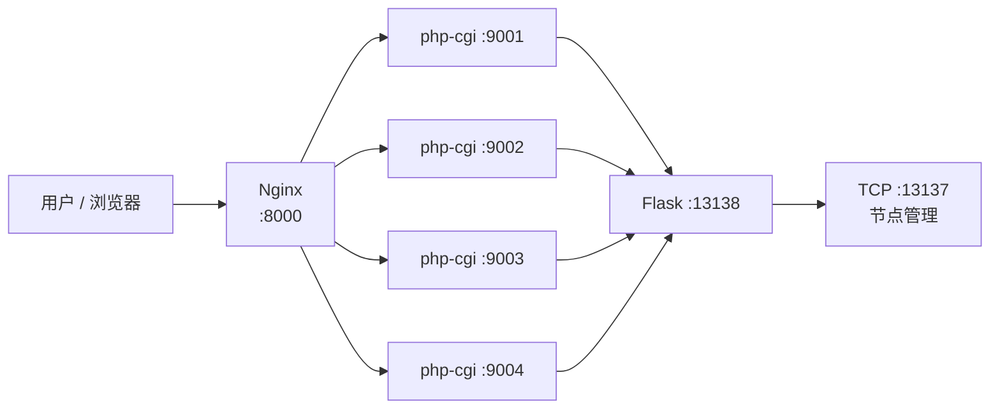

# 37AC 前端部署指南（Windows：Nginx + PHP-CGI）

> Windows 无 PHP-FPM（仅 Linux/Unix 提供），使用 **多个 `php-cgi.exe` 实例组成进程池** 实现同等效果。
> 相比 `php -S` 内置服务器（单线程），Nginx + PHP-CGI 进程池可**并发处理请求**，
> SSE 流式长连接只会占用一个 php-cgi 实例，其余请求由其他实例并行处理。

## 架构



## 环境要求

| 组件 | 要求 | 说明 |
|---|---|---|
| Nginx | 1.26+ | 安装于 `C:\tools\nginx` |
| PHP | 8.x（含 `php-cgi.exe`） | 本机 `E:\apps\PHP` |
| Flask 服务端 | 运行中 | `python src/server/runserver.py`，监听 `13138`/`13137` |

## 一、安装 Nginx（一次性）

```powershell
# 下载稳定版
Invoke-WebRequest -Uri "https://nginx.org/download/nginx-1.26.3.zip" -OutFile "C:\tools\nginx-1.26.3.zip"
# 解压并重命名
Expand-Archive -Path "C:\tools\nginx-1.26.3.zip" -DestinationPath "C:\tools\" -Force
Rename-Item "C:\tools\nginx-1.26.3" "C:\tools\nginx"
# 校验
& "C:\tools\nginx\nginx.exe" -v
```

## 二、PHP 专用配置 `php-cgi.ini`（一次性）

FastCGI 模式下 **Xdebug 会拖慢每个请求**（函数级 hook），而 opcache 能显著提速。
为 `php-cgi` 生成专用配置（不影响 CLI 调试用的 `php.ini`）：

```powershell
$src = Get-Content "E:\apps\PHP\php.ini"
$lines = New-Object System.Collections.Generic.List[string]
foreach ($l in $src) {
    $trimmed = $l.Trim()
    # 剔除 Xdebug 相关行
    if ($trimmed -match '^zend_extension=.*xdebug' -or $trimmed -eq '[xdebug]' -or $trimmed -match '^xdebug\.') { continue }
    # 启用 opcache
    if ($trimmed -eq ';zend_extension=opcache') { $lines.Add('zend_extension=opcache'); continue }
    if ($trimmed -eq ';opcache.enable=1') { $lines.Add('opcache.enable=1'); continue }
    $lines.Add($l)
}
[System.IO.File]::WriteAllLines("E:\apps\PHP\php-cgi.ini", $lines, (New-Object System.Text.UTF8Encoding $false))
# 验证：应显示 opcache.enable = On，且无 xdebug
& "E:\apps\PHP\php-cgi.exe" -c "E:\apps\PHP\php-cgi.ini" -i | Select-String "opcache.enable|xdebug"
```

> 实测：未优化前 `/upload` 响应 6~14 秒；禁用 Xdebug + 启用 opcache 后降至 **0.2 秒**。

## 三、Nginx 配置 `C:\tools\nginx\conf\nginx.conf`

关键点：

- `root E:/pj/37AC/src/www/public;` — 站点根目录
- `try_files $uri $uri/ /index.php?$query_string;` — 对应原 `.htaccess` 重写规则
- `upstream php_backend { server 127.0.0.1:9001..9004; }` — PHP-CGI 进程池
- `fastcgi_buffering off;` — SSE 流式响应实时透传，不做缓冲
- `fastcgi_read_timeout 480s;` — 适配最长 SSE 长连接（识别方式不同等待上限不同：local 约 3 分钟，LLM/auto 约 7 分钟，均含排队重试时间）
- `client_max_body_size 12m;` — 图片上传上限

完整配置见仓库 `docs/` 附件说明，或参照 `src/www/start-nginx.bat` 启动流程。

## 四、启动 / 停止

```bat
:: 启动（Nginx + 4 个 php-cgi 实例）
src\www\start-nginx.bat

:: 停止
src\www\stop-nginx.bat
```

启动脚本要点：

1. 检查 8000 端口空闲
2. 启动 4 个 `php-cgi.exe`（监听 9001~9004，使用 `php-cgi.ini`）
3. 启动 Nginx（`-p C:\tools\nginx\` 指定前缀目录）

## 五、验证

```powershell
# 页面
curl.exe -s -o NUL -w "%{http_code} (%{time_total}s)`n" http://localhost:8000/upload
# 期望: 200 (<1s)

# SSE 全链路（Nginx → PHP → Flask → 节点）
curl.exe -s -N --max-time 480 `
  -H "X-Stream-Response: true" -H "X-Requested-With: XMLHttpRequest" `
  -F "file=@test.png" -F "recognition_type=local" `
  http://localhost:8000/api/upload
# 期望: 依次收到 queued → ... → completed 事件

# 无节点排队场景（观察重试与等待提示）
# 期望: queued(含 timeout 提示) → waiting(含 retry_in 倒计时) → 节点上线后自动分发
```

## 六、故障排查

| 现象 | 原因 | 解决 |
|---|---|---|
| 页面响应 6~14 秒 | Xdebug 在 FastCGI 下每请求开销 | 确认 `php-cgi.ini` 无 Xdebug |
| SSE 不实时，攒批返回 | Nginx 缓冲了响应 | 确认 `fastcgi_buffering off` |
| `nginx: [emerg] unknown directive "锘?` | 配置文件带 UTF-8 BOM | 用无 BOM 编码重写 conf |
| 端口被占用 | 旧服务未停止 | `stop-nginx.bat` 或 `taskkill /IM nginx.exe /F` |
| 上传 413 | 图片超过限制 | 调大 `client_max_body_size` |

## 七、生产环境建议

- 本项目 Nginx 配置为**开发/内网**用途（无 TLS、单机部署）
- 生产建议：启用 HTTPS（`ssl_certificate`）、隐藏 server 版本、按需调整 `worker_processes`
- 若部署到 Linux，可直接替换为原生 **PHP-FPM**（`fastcgi_pass unix:/run/php/php8.x-fpm.sock;`），其余配置不变
